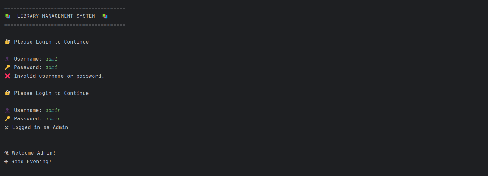
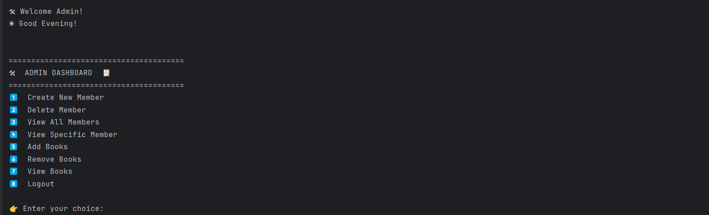
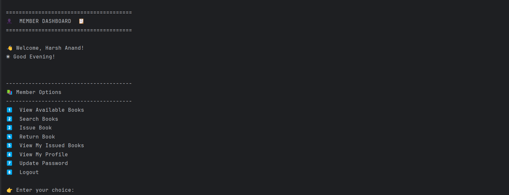
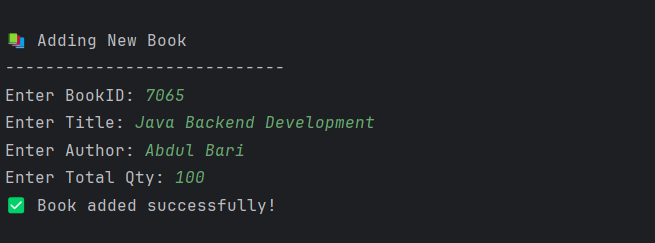
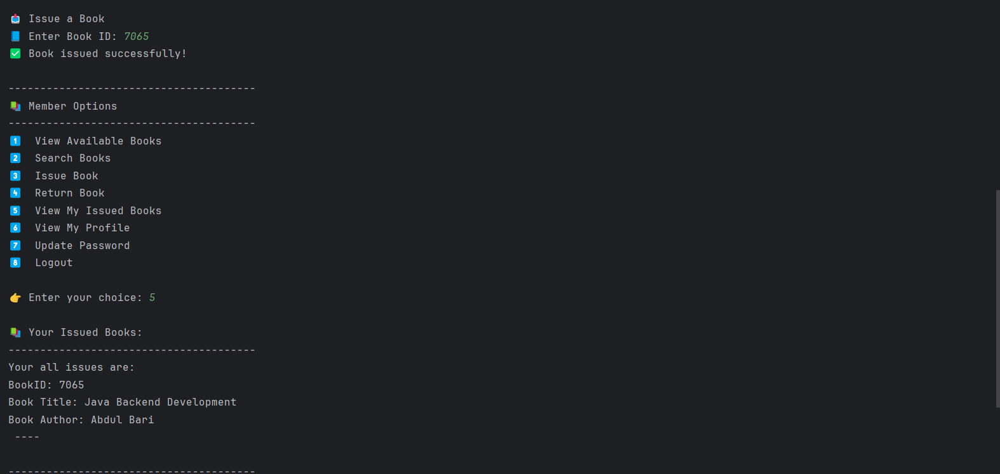
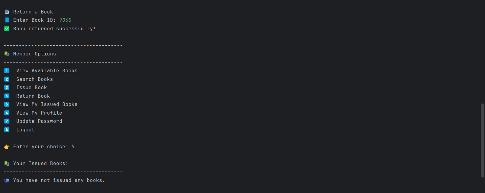
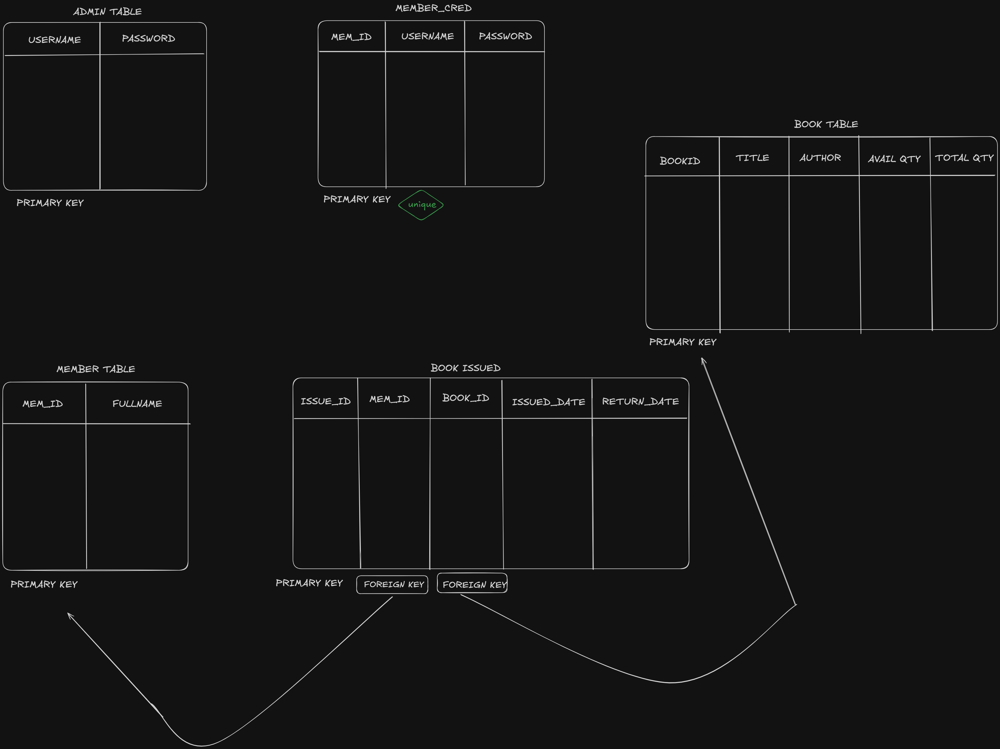

# 📚 Library Management System (Console Based)

A fully functional Java Console-Based Library Management System built using **JDBC** and **MySQL** with layered architecture.

This project simulates real-world backend logic including authentication, role-based dashboards, book issuing/returning, and member management with database persistence.

---

## 🚀 Features

### 🔐 Authentication System
- admin account auto-creation (if not exists)
- Role-based login (admin / member)
- Credential verification using database queries
- Password update functionality for members

---

### 🛠 admin Dashboard
- Create new members
- Delete members
- View all members
- View specific member details
- Add new books
- Remove books
- View all books (with stock details)
- Logout functionality

---

### 👤 member Dashboard
- View available books
- Search books by:
    - Book ID
    - Title
    - Author
- Issue book (with duplicate prevention)
- Return book
- View issued books
- View profile
- Update password
- Logout

---

## 🧠 Core Concepts Used

- Object-Oriented Programming (OOP)
- Layered Architecture (UI → Operations → Repository → Model)
- JDBC (Java Database Connectivity)
- MySQL Database Integration
- SQL Joins & Aggregations
- Collections (`ArrayList`, `ListIterator`)
- Encapsulation & Proper Model Design
- Separation of Concerns
- Input Validation & Edge Case Handling

---

## 🔧 Implemented Versions

This project has been implemented using multiple backend persistence approaches for learning purposes:

### 1️⃣ Java Serialization Version

- File-based storage using .ser files 
- Used Java Object Serialization for persistence

### 2️⃣ JDBC + MySQL Version (Current)
- Database-based persistence using JDBC 
- SQL queries for CRUD operations 
- Relational database design

### 3️⃣ Spring Boot REST API (Coming Soon 🚀)
- Planned upgrade to:
- Spring Boot backend 
- REST API architecture 
- Spring Data JPA / Hibernate 
- Production-level backend design

---

## 📸 Application Screenshots

### 🔐 Login Screen


---

### 🛠 admin Dashboard


---

### 👤 member Dashboard


---

### 📚 Book Add Flow


---

### 📚 Book Issue Flow


---

### 📘 Book Return Flow


### 🛢️ Database Design


---

## 📂 Project Structure

```
Library-Management-System/
│
├── src
│
├── admin
│   ├── Admin.java
│   └── AdminDashboard.java
│
├── auth
│   ├── AuthRepo.java
│   └── AuthService.java
│
├── books
│   ├── Book.java
│   ├── BookDashboard.java
│   ├── BookOperations.java
│   └── BookRepo.java
│
├── login
│   └── LoginDashboard.java
│
├── member
│   ├── Member.java
│   ├── MemberDashboard.java
│   ├── MemberOperations.java
│   └── MemberRepo.java
│
├── main
│   └── LandingPage.java
│
├── util
│   ├── DatabaseConnection.java
│   └── DatabaseInitializer.java
│
├── assets
│   └── screenshots
│
└── README.md
```


---

## 💾 Data Persistence

This system uses MySQL database via JDBC for storing application data.

```declarative
admin_table
member_table
member_cred_table
book_table
book_issued
```
---

## 🔄 Book Issuing Logic

- Prevents issuing the same book twice to the same member
- Prevents issuing when stock is unavailable
- Automatically updates available quantity
- Maintains book issuing records in the database
- Synchronizes issued books with member accounts during login
- Keeps member and book records in sync

---

## 🏗 Architecture Overview
```
Dashboard (UI Layer)
↓
Operations (Business Logic Layer)
↓
Repository (Persistence Layer)
↓
Model (Data Layer)
```

## 🛠 Technologies Used

- Java
- JDBC
- MySQL
- SQL
- OOP Principles

---

## 📌 Future Improvements (Will be done soon)

- Convert console application to Spring Boot REST API 
- Add authentication using JWT 
- Add book due-date tracking & fine system 
- Build a simple frontend (React / HTML)

---
 